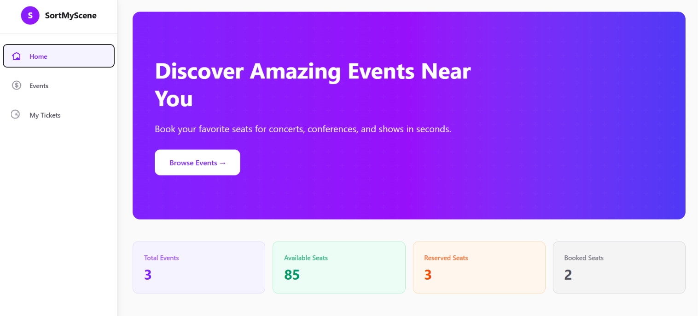
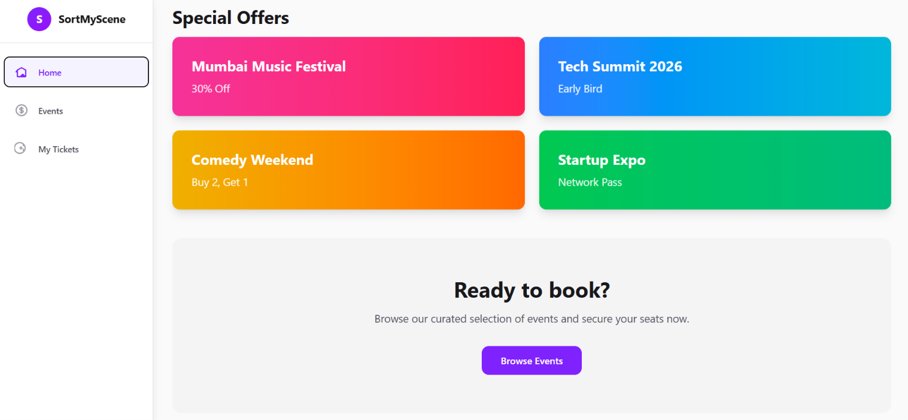
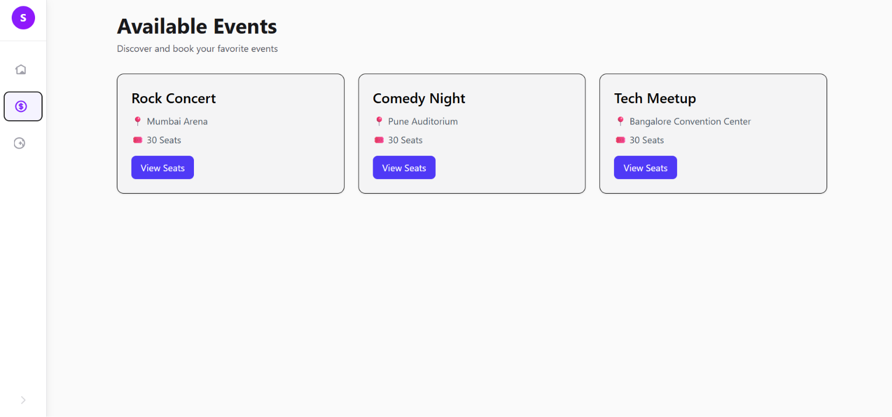
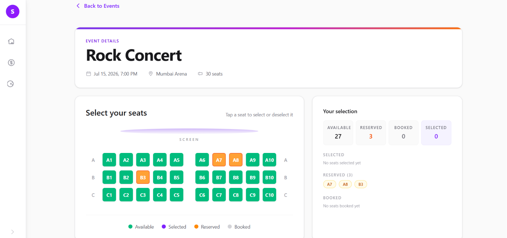
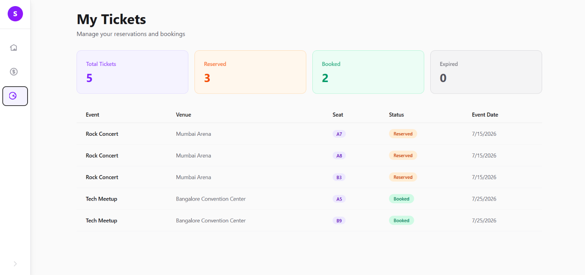

# SortMyScene - Event Ticket Booking System

A full-stack event ticket booking platform that lets users browse events, select seats from an interactive theater-style layout, and complete a time-limited reservation before confirming a booking. Built with the MERN stack, with a focus on seat-level concurrency safety and a clear reservation-to-booking lifecycle.

## Features

- Browse available events
- Interactive seat selection
- Seat reservation system
- Booking confirmation
- Reservation expiry mechanism
- Live countdown timer
- Seat statistics dashboard
- Responsive UI
- Validation and error handling

## Tech Stack

**Frontend**
- React
- Vite
- Tailwind CSS
- Axios
- React Router

**Backend**
- Node.js
- Express.js
- MongoDB
- Mongoose

**Backend**
- Render (Backend)
- Vercel (Frontend)
- MongoDB Atlas (Database)

## Project Architecture

```
Frontend (React + Vite)
        ↓
REST API (Express.js)
        ↓
MongoDB (Mongoose)
```

The backend follows a controller-service pattern, with business logic and validation isolated in the service layer. A background job runs on a fixed interval to release expired reservations back to the available pool.

## Project Structure

```
SortMyScene-Assignment/
│
├── LICENSE
├── README.md
│
├── backend/
│   ├── .env
│   ├── .env.example
│   ├── .gitignore
│   ├── package.json
│   ├── package-lock.json
│   │
│   └── src/
│       ├── app.js
│       ├── server.js
│       ├── config/
│       │   └── db.js
│       ├── controllers/
│       │   ├── booking.controller.js
│       │   ├── event.controller.js
│       │   └── reservation.controller.js
│       ├── jobs/
│       │   └── reservationExpiryJob.js
│       ├── middleware/
│       ├── models/
│       │   ├── booking.model.js
│       │   ├── event.model.js
│       │   ├── reservation.model.js
│       │   ├── seat.model.js
│       │   └── user.model.js
│       ├── routes/
│       │   ├── booking.routes.js
│       │   ├── event.routes.js
│       │   └── reservation.routes.js
│       ├── services/
│       │   ├── booking.service.js
│       │   └── reservation.service.js
│       ├── seed/
│       │   └── seedData.js
│       └── utils/
│           └── generateSeats.js
│
├── frontend/
│   ├── .env
│   ├── .env.example
│   ├── .gitignore
│   ├── index.html
│   ├── package.json
│   ├── package-lock.json
│   ├── eslint.config.js
│   ├── vite.config.js
│   ├── vercel.json
│   ├── public/
│   └── src/
│       ├── App.jsx
│       ├── main.jsx
│       ├── assets/
│       ├── components/
│       │   ├── booking/
│       │   │   └── SeatGrid.jsx
│       │   ├── common/
│       │   │   └── Toast.jsx
│       │   ├── event/
│       │   │   ├── EventCard.jsx
│       │   │   └── EventList.jsx
│       │   └── layout/
│       │       ├── Layout.jsx
│       │       └── Navbar.jsx
│       ├── context/
│       │   ├── AuthContext.jsx
│       │   └── SidebarContext.jsx
│       ├── hooks/
│       │   ├── useCountdown.js
│       │   └── useLocalStorage.js
│       ├── pages/
│       │   ├── EventDetails.jsx
│       │   ├── Events.jsx
│       │   ├── Home.jsx
│       │   ├── MyTickets.jsx
│       │   └── NotFound.jsx
│       ├── routes/
│       │   └── appRoutes.jsx
│       ├── services/
│       │   ├── api.js
│       │   ├── authService.js
│       │   ├── bookingService.js
│       │   ├── eventService.js
│       │   └── reservationService.js
│       ├── styles/
│       │   ├── globals.css
│       │   └── variables.css
│       └── utils/
│           └── constants.js
│
└── image-assets/    
    ├── home1.png
    ├── home2.png
    ├── events.png
    ├── eventdetails.png
    └── ticketinfo.png```

## API Endpoints

### Events
| Method | Endpoint           | Description                                  | Query/Body Parameters |
|--------|---------------------|-----------------------------------------------|----------------------|
| GET    | `/api/events`       | Retrieve all available events                | None                 |
| GET    | `/api/events/:id`   | Retrieve a single event with its seats       | `id` (event ID)      |

### Reservations
| Method | Endpoint        | Description                           | Query/Body Parameters |
|--------|-----------------|---------------------------------------|----------------------|
| GET    | `/api/reserve`  | Get all reservations for a user       | `userId` (query param) |
| POST   | `/api/reserve`  | Reserve selected seats for 10 minutes | `userId`, `eventId`, `seatNumbers[]` (JSON body) |
| DELETE | `/api/reserve`  | Cancel an active reservation          | `reservationId`, `eventId` (JSON body) |

### Bookings
| Method | Endpoint        | Description                           | Query/Body Parameters |
|--------|-----------------|---------------------------------------|----------------------|
| GET    | `/api/bookings` | Get all bookings for a user           | `userId` (query param) |
| POST   | `/api/bookings` | Confirm a reservation to booking      | `reservationId` (JSON body) |

### Request/Response Examples

**GET /api/events**
```bash
curl http://localhost:5000/api/events
```

**GET /api/events/:id**
```bash
curl http://localhost:5000/api/events/6a37d701ccb6acd150760186
```

**GET /api/reserve?userId=demo-user**
```bash
curl http://localhost:5000/api/reserve?userId=demo-user
```

**POST /api/reserve**
```bash
curl -X POST http://localhost:5000/api/reserve \
  -H "Content-Type: application/json" \
  -d '{
    "userId": "demo-user",
    "eventId": "6a37d701ccb6acd150760186",
    "seatNumbers": ["A1", "A2", "B3"]
  }'
```

**POST /api/bookings**
```bash
curl -X POST http://localhost:5000/api/bookings \
  -H "Content-Type: application/json" \
  -d '{
    "reservationId": "507f1f77bcf86cd799439011"
  }'
```

**DELETE /api/reserve**
```bash
curl -X DELETE http://localhost:5000/api/reserve \
  -H "Content-Type: application/json" \
  -d '{
    "reservationId": "507f1f77bcf86cd799439011",
    "eventId": "6a37d701ccb6acd150760186"
  }'
```

**GET /api/bookings?userId=demo-user**
```bash
curl http://localhost:5000/api/bookings?userId=demo-user
```

## Reservation & Booking Flow

1. User selects one or more available seats
2. User clicks Reserve Seats
3. A reservation is created, valid for 10 minutes
4. A countdown timer starts on the reservation
5. User clicks Confirm Booking before the timer expires
6. Seats are marked as booked and the reservation is removed
7. Reservations left unconfirmed are automatically released by a background job

## Validation & Error Handling

- Required field validation on reservation and booking requests
- Empty seat selection is rejected
- Duplicate seat numbers in a single request are rejected
- Invalid seat format detection
- Non-existent seat detection
- Seat availability checks before a reservation is created
- Reservation expiry validation at booking confirmation
- Descriptive error responses surfaced in the UI

## Screenshots

## Screenshots

### Home Dashboard



### Featured Events & Statistics



### Events Listing



### Event Details & Seat Booking



### My Tickets



## Video Demonstration

Video Walkthrough: [Add Google Drive Link Here]

## Live Demo

Deployment Link: https://sortmyscene.bhuvangolhar.space

## Local Setup Instructions

**Clone Repository**

```bash
git clone https://github.com/bhuwangolhar/SortMyScene-Assignment
cd SortMyScene
```

**Backend Setup**

```bash
cd backend
npm install
```

Create `.env`

```env
PORT=5000
MONGO_URI=your_mongodb_connection_string
```

Run backend

```bash
npm run dev
```

Seed Database

To clear all the existing data

```bash
npm run seed
```

**Frontend Setup**

```bash
cd frontend
npm install
```

Create `.env`

```env
VITE_API_URL=http://localhost:5000/api
```

Run frontend

```bash
npm run dev
```

## Future Improvements

- Authentication & authorization
- Real-time seat updates with WebSockets
- Payment gateway integration
- Booking history
- Admin dashboard

## Author

**Name:** Bhuvan Golhar
**LinkedIn:** https://www.linkedin.com/in/bhuvangolhar